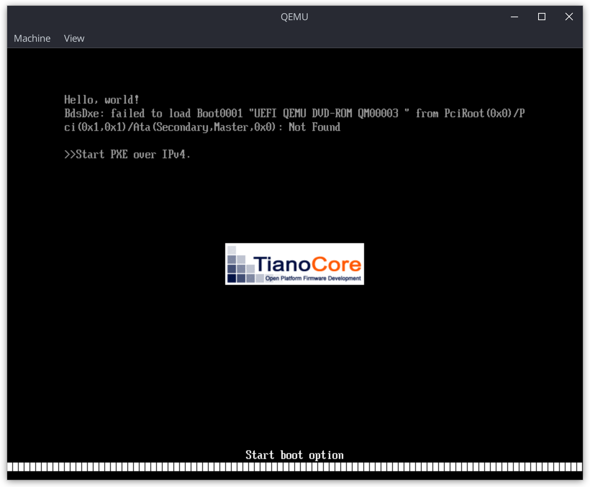
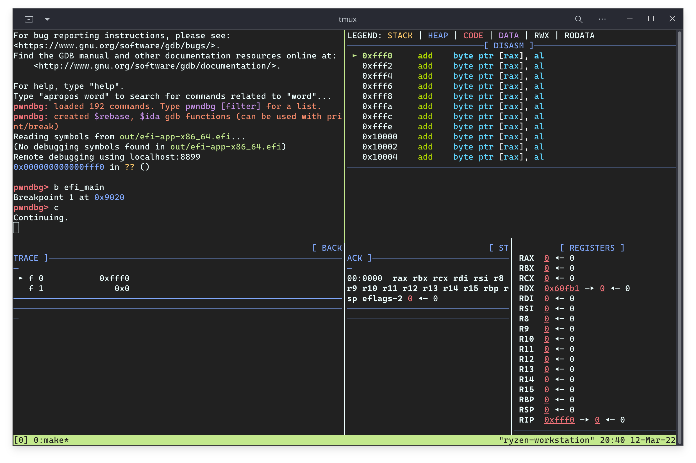

# UEFI Application Template

Tested with Arch Linux, all dependencies were synced from Arch Linux offical repositories.

- core/make
- core/gdb
- core/binutils
- extra/gnu-efi
- extra/qemu
- extra/edk2-ovmf # /usr/share/edk2-ovmf
- extra/clang
- extra/lld
- extra/llvm

Update `EDK2_OVMF` in `Makefile` and then run `make qemu` or `make debug`

